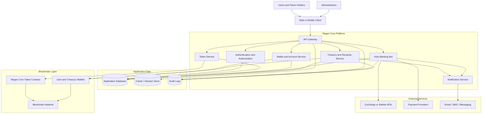

# Regen Core Token — Architecture Overview

Regen Core is organized around a token platform, backend services, automated banking operations, and external blockchain infrastructure.

## Core Components

| Component | Responsibility |
|---|---|
| API Gateway | Provides the main interface for clients and administrative tools. |
| Authentication and Authorization | Handles user identity, access control, and protected operations. |
| Token Service | Provides token balances, transfers, issuance, and transaction history. |
| Wallet and Account Service | Manages user wallets, treasury wallets, and account associations. |
| Auto-Banking Bot | Automates deposits, withdrawals, conversions, and scheduled financial operations. |
| Treasury and Rewards Service | Manages platform funds, rewards, fees, and distribution rules. |
| Token Contract | Defines the on-chain behavior of the Regen Core token. |
| Application Database | Stores users, accounts, transactions, configuration, and operational state. |
| Audit Logs | Records security-sensitive and financial events for traceability. |

## Primary Transaction Flow

1. A user submits an operation through the client application.
2. The API Gateway authenticates the request and validates permissions.
3. The relevant service validates business rules and records the operation.
4. Blockchain-related operations are submitted to the token contract.
5. The service monitors confirmation status from the blockchain network.
6. The transaction state and audit record are updated.
7. The user receives the result through the client and notification channels.

## Security Considerations

- Protect private keys using a dedicated secrets manager or hardware-backed wallet.
- Require strong authentication for administrative and treasury operations.
- Apply idempotency keys to transfers, deposits, and withdrawals.
- Record immutable audit events for financial operations.
- Validate all blockchain transaction parameters before signing.
- Separate user funds, treasury funds, and operational service accounts.
- Monitor failed transactions, abnormal balances, and suspicious activity.
