# Regen Core Token — Architecture Overview

Regen Core is organized around a token platform, backend services, automated banking operations, blockchain infrastructure, and operational tooling for development and deployment.

```mermaid
flowchart TB
    User[Users and Token Holders]
    Admin[Administrators]
    Client[Web or Mobile Client]

    subgraph Platform["Regen Core Platform"]
        API[API Gateway]
        Auth[Authentication and Authorization]
        Token[Token Service]
        Wallet[Wallet and Account Service]
        Banking[Auto-Banking Bot]
        Treasury[Treasury and Rewards Service]
        Notifications[Notification Service]
    end

    subgraph Data["Application Data and Services"]
        DB[(Application Database)]
        Cache[(Cache / Session Store)]
        Audit[(Audit Logs)]
        Queue[Message Queue / Event Bus]
        Search[Search and Indexing]
    end

    subgraph Blockchain["Blockchain Layer"]
        Network[Blockchain Network]
        Contract[Regen Core Token Contract]
        Wallets[User and Treasury Wallets]
    end

    subgraph External["External Services"]
        Exchange[Exchange or Market APIs]
        Payment[Payment Providers]
        Messaging[Email / SMS / Messaging]
        Oracle[Price / Data Oracles]
    end

    subgraph Tools["Platform and Tools"]
        CI[CI / CD Pipeline]
        Repo[GitHub Repository]
        Docker[Container Platform]
        Monitor[Monitoring and Alerts]
        Sec[Secrets / Key Vault]
        IaC[Infrastructure as Code]
    end

    User --> Client
    Admin --> Client
    Client --> API

    API --> Auth
    API --> Token
    API --> Wallet
    API --> Banking
    API --> Treasury

    Auth --> DB
    Token --> DB
    Wallet --> DB
    Banking --> DB
    Treasury --> DB

    API --> Cache
    API --> Audit
    Banking --> Audit
    Treasury --> Audit
    Banking --> Queue
    Token --> Search

    Token --> Contract
    Wallet --> Wallets
    Treasury --> Wallets
    Contract --> Network
    Wallets --> Network
    Contract --> Oracle

    Banking --> Exchange
    Banking --> Payment
    Notifications --> Messaging
    Treasury --> Notifications
    Banking --> Notifications

    Repo --> CI
    CI --> Docker
    Docker --> Monitor
    Sec --> API
    Sec --> Wallet
    IaC --> Network
    IaC --> DB
```

## Platform Components

| Layer | Components | Purpose |
|---|---|---|
| Client Layer | Web app, mobile app, admin portal | User interaction and account management. |
| Application Platform | API Gateway, authentication, token service, wallet service, treasury service | Core business logic for token operations. |
| Integration Layer | Auto-banking bot, payment providers, exchange APIs, oracles | Handles automation and financial connectivity. |
| Data Layer | PostgreSQL, Redis, audit logs, message queue, search index | Storage, caching, state, and event-driven communication. |
| Blockchain Layer | Smart contract, network, wallet infrastructure | Responsible for on-chain token logic and settlement. |
| Platform & Tooling | GitHub, Docker, CI/CD, infrastructure automation, secrets manager, monitoring | Supports secure delivery, operations, and observability. |

## Core Platform Tools

- GitHub: source control, issue tracking, review workflows, code collaboration.
- CI/CD pipeline: automated testing, build validation, and deployment checks.
- Docker / containers: standardized runtime environment for services.
- Infrastructure as Code: reproducible deployment of infrastructure, networking, and cloud resources.
- Secrets Manager / Key Vault: protects wallet keys, API credentials, and certificates.
- Monitoring and Alerts: tracks health, latency, failures, blockchain confirmations, and unusual transaction activity.
- Message Queue: decouples event-driven workflows such as settlement, notification triggers, and treasury actions.

## Primary Transaction Flow

1. A user submits an operation through the client application.
2. The API Gateway authenticates the request and validates permissions.
3. The relevant platform service validates business rules and writes state to the application database.
4. Transaction or treasury actions are sent to the blockchain contract via the wallet service.
5. The system monitors confirmation and state changes on-chain.
6. Event messages are published to the queue and downstream services react to them.
7. Audit logs and alerts are generated for operational and security review.

## Security Considerations

- Protect private keys using a dedicated secrets manager or hardware-backed wallet.
- Require strong authentication for administrative and treasury operations.
- Use message queue idempotency and replay safeguards for event-driven processing.
- Maintain immutable audit trails for financial operations and blockchain actions.
- Validate all blockchain transaction parameters before signing.
- Keep infrastructure deployment automated and version-controlled via IaC.
- Monitor wallet balances, failed transactions, abnormal activity, and service health in real time.
